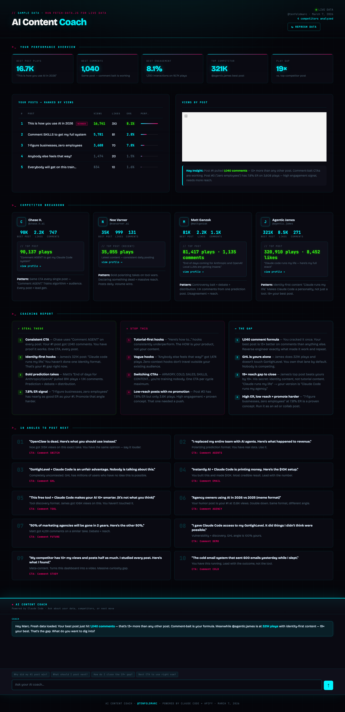
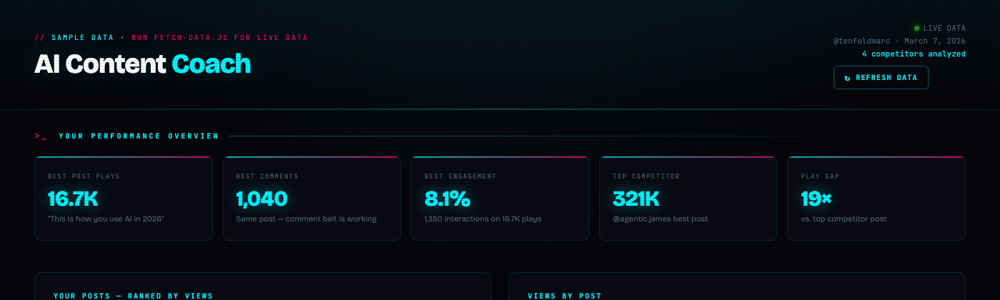
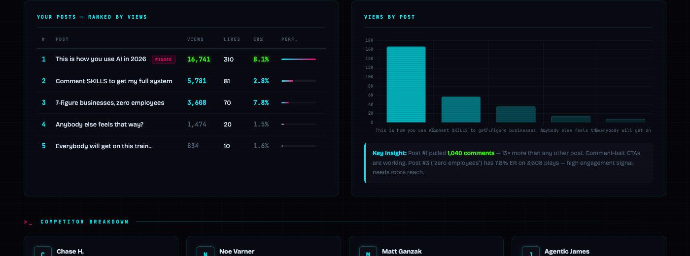
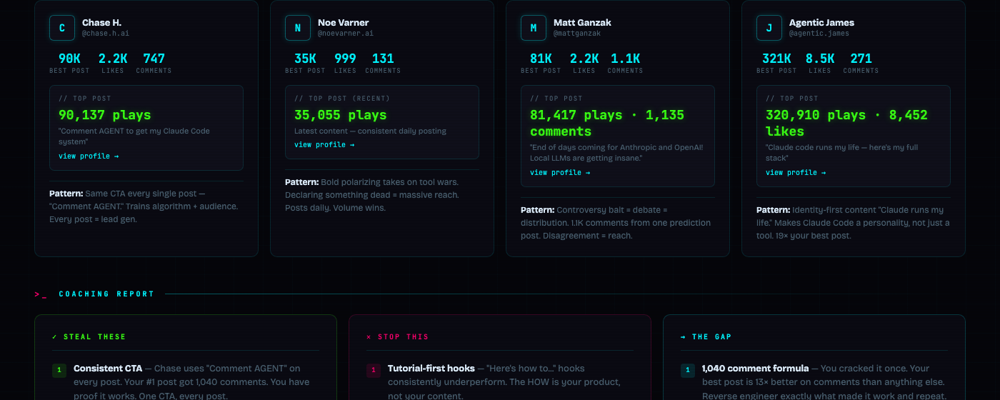
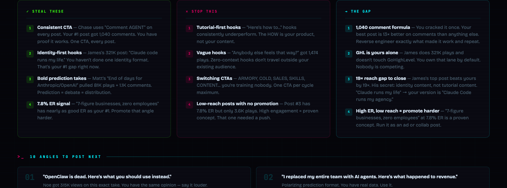
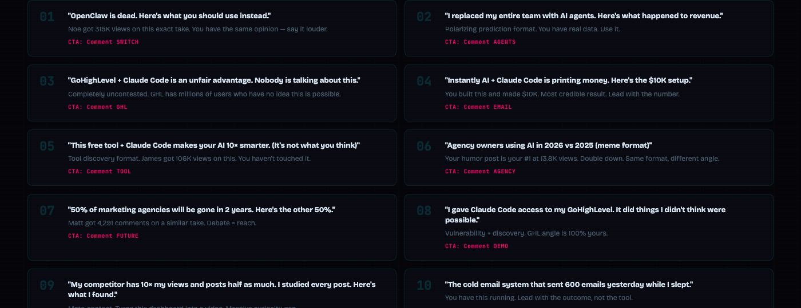
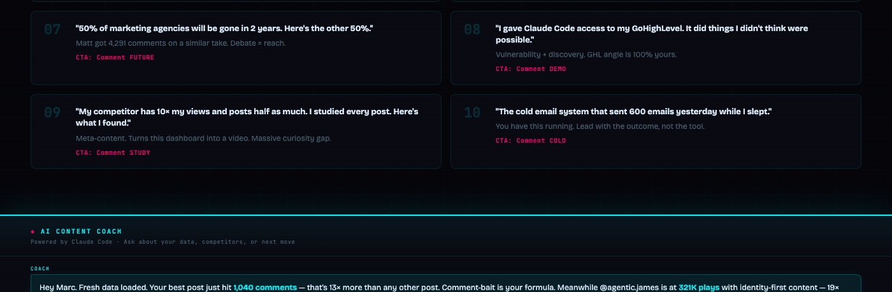

# AI Content Coach Dashboard

> Scrape your Instagram posts, download every reel, transcribe them with Whisper, spy on competitors — then chat with Claude about all of it. Self-hosted. Free. Yours in 10 minutes.



People charge $15k for this kind of content intelligence setup. This repo gives it to you free.

---

## What It Does

Every time you run it, the dashboard automatically:

- **Scrapes your last 25 Instagram posts** — views, likes, comments, engagement rate
- **Scrapes your competitors** — their top posts, patterns, what's working for them
- **Downloads every reel** with yt-dlp and **transcribes them** with Whisper
- **Analyzes the data** — what to steal, what to stop, where the gap is
- **Powers a Claude AI chat** trained on your full post history + all competitor data

Then you get a live dashboard you can ask anything:

> *"Why did my #1 post win?"*
> *"What should I post next?"*
> *"How do I close the 19× reach gap vs my top competitor?"*

---

## The Dashboard

### Stats + Your Posts


Your top metrics at a glance — best post plays, comments, engagement rate, and how far behind your top competitor is. Posts ranked by views with performance bars.

### Your Posts vs Chart


Full post table with views, likes, engagement rate, and a visual bar chart so you can see the gap between your best post and everything else instantly.

### Competitor Intelligence


4 competitors tracked side-by-side — best post stats, top caption, and the **pattern** behind what's driving their reach. This is where you steal ideas.

### Coaching Report


Three columns: what to **steal**, what to **stop**, and **the gap** between you and your top competitor. Every insight is backed by actual data from your posts.

### 10 Angles to Post Next


Claude analyzes your data + competitor patterns and generates 10 ready-to-record video angles — with hooks, the reason it works, and a CTA for each one.

### AI Chat


A Claude-powered chat at the bottom of the dashboard trained on your full post history, transcripts, and competitor data. Ask it anything about your content strategy.

---

## What You Need

| Tool | What it's for | Cost |
|------|--------------|-------|
| [Claude Code](https://claude.ai/code) | Runs the AI chat | Free with Claude subscription |
| [Apify](https://apify.com) | Scrapes Instagram | ~$0.03 per full run |
| Node.js 18+ | Runs the server + scraper | Free |
| Python 3 | Runs Whisper | Free |
| yt-dlp | Downloads reels | Free |
| Whisper | Transcribes reels | Free |
| ffmpeg | Audio processing | Free |

Total cost per data refresh: **about 3 cents.**

---

## Setup

### Step 1 — Clone the repo

```bash
git clone https://github.com/tenfoldmarc/ai-content-coach-dashboard.git
cd ai-content-coach-dashboard
```

### Step 2 — Install the Claude Code skill

Copy the skill folder into your Claude skills directory:

```bash
cp -r skill ~/.claude/skills/content-coach
```

### Step 3 — Let Claude walk you through the rest

Open any project in Claude Code and type:

```
/content-coach
```

Claude will check all your prerequisites, ask for your Instagram handle and competitors, set up your Apify token, and get everything running. Takes about 10 minutes.

---

## Manual Setup (if you prefer)

If you'd rather do it yourself:

### 1. Install dependencies

```bash
npm install
```

### 2. Install system tools

```bash
# macOS
brew install ffmpeg yt-dlp
pip3 install openai-whisper
```

### 3. Configure your accounts

```bash
cp config.example.json config.json
```

Edit `config.json`:

```json
{
  "yourHandle": "yourinstagramhandle",
  "yourName": "Your Name",
  "postsPerAccount": 25,
  "competitors": [
    { "handle": "competitor1", "name": "Competitor 1", "pattern": "" },
    { "handle": "competitor2", "name": "Competitor 2", "pattern": "" },
    { "handle": "competitor3", "name": "Competitor 3", "pattern": "" }
  ]
}
```

### 4. Add your Apify token

Get a free token at [apify.com](https://apify.com) → Settings → API tokens.

```bash
cp .env.example .env
```

Edit `.env`:
```
APIFY_TOKEN=apify_api_your_token_here
```

### 5. Set up Claude auth

**Option A — Claude subscription (claude.ai):**
Nothing to do. The server uses your installed Claude Code automatically.

**Option B — Anthropic API key:**
Add to `.env`:
```
ANTHROPIC_API_KEY=sk-ant-your-key-here
```

### 6. Fetch your data

```bash
node fetch-data.js
```

This scrapes your posts + competitors, downloads reels, and transcribes everything. Takes 2–4 minutes.

### 7. Start the dashboard

```bash
node server.js
```

Open [http://localhost:3003](http://localhost:3003)

---

## Daily Use

**Refresh your data** — click the **↻ Refresh Data** button in the top right of the dashboard. It runs the full scrape, download, and transcription pipeline and reloads automatically when done.

**Or from the terminal:**
```bash
node fetch-data.js   # refresh data
node server.js       # start dashboard
```

The more you refresh, the more post history you accumulate. The AI chat gets smarter over time because it has more data to work with.

---

## How the Chat Works

The AI chat at the bottom of the dashboard is powered by Claude and trained on:

- All your saved Instagram posts (views, likes, comments, transcripts)
- All competitor posts (same data)
- Patterns identified from the data

It knows your numbers. Ask it specific questions:

- *"Which of my hooks performed best and why?"*
- *"What topic should I make my next 3 videos about?"*
- *"What is @competitor doing that I'm not?"*
- *"I want to hit 100K views. What needs to change?"*

---

## File Structure

```
ai-content-coach-dashboard/
├── index.html              # The dashboard UI
├── server.js               # Local server (chat + refresh endpoint)
├── fetch-data.js           # Instagram scraper + transcription
├── config.example.json     # Copy to config.json with your handles
├── config.example.js       # Copy to config.js with your API key (optional)
├── .env.example            # Copy to .env with your Apify token
├── skill/
│   └── SKILL.md            # Claude Code skill — copy to ~/.claude/skills/content-coach/
└── data/                   # Auto-generated, gitignored
    ├── data.js             # Dashboard data file
    ├── posts/              # Per-account JSON files
    └── videos/             # Temporary video files (deleted after transcription)
```

---

## FAQ

**Can I track more than 4 competitors?**
Yes — add as many as you want to `config.json`. Each one costs ~$0.003 to scrape.

**What if my account is private?**
Apify can scrape private accounts if you provide Instagram login credentials. Transcription via yt-dlp also requires auth for private posts. Public accounts work out of the box.

**Does it work without yt-dlp/Whisper?**
Yes — transcription is optional. If the tools aren't installed, `fetch-data.js` skips that step and still saves post metadata. The AI chat works fine, it just won't have transcript content.

**Do I need Claude Code?**
You need either Claude Code (OAuth) or an Anthropic API key. If you have a claude.ai subscription, you have Claude Code — [install it here](https://claude.ai/code).

**How much does Apify cost?**
About $0.002–$0.006 per profile scraped. A full run (you + 4 competitors, 25 posts each) costs around $0.03. You get $5 free credit when you sign up — that's 150+ full runs.

---

## Built With

- [Claude Code](https://claude.ai/code) — AI chat and setup automation
- [Apify](https://apify.com) — Instagram scraping
- [yt-dlp](https://github.com/yt-dlp/yt-dlp) — reel downloading
- [OpenAI Whisper](https://github.com/openai/whisper) — transcription
- [Chart.js](https://www.chartjs.org/) — dashboard charts

---

Built by [@tenfoldmarc](https://www.instagram.com/tenfoldmarc/)
